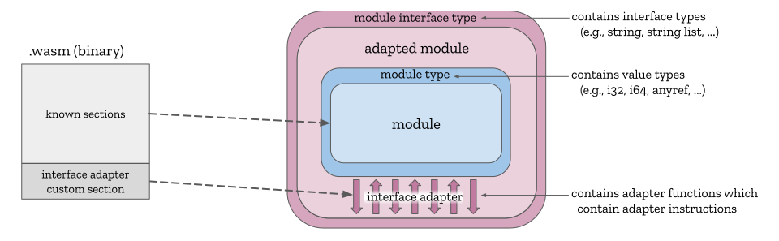

# Interface Types Proposal

The proposal adds a new set of **interface types** to WebAssembly that describe
high-level values (like strings, sequences, records and variants) without
committing to a single memory representation or sharing scheme. Interface types
can only be used in the interfaces of modules and can only be produced or
consumed by declarative **interface adapters**.

The proposal is semantically layered on top of the WebAssembly [core spec]
(extended with the [multi-value] and [reference types] proposals), and
adds only the ability to adapt the imports and exports of a WebAssembly
module at points which are already host-defined behavior. All adaptations are
specified in a [custom section] and this feature can be polyfilled using the
[JS API].

1. [Motivation](#motivation)
1. [Overview](#overview)
1. [Walkthrough](#walkthrough)
1. [Web IDL integration](#web-idl-integration)
1. [FAQ](#faq)


## Motivation

This proposal is motivated by 3 distinct problems:

**Optimizing calls to Web APIs**

With the [reference types] proposal, WebAssembly code can pass around arbitrary
JavaScript values using the [`anyref`] type. By default, JavaScript
values flowing into WebAssembly get boxed into `anyref` values which are then
unboxed whenever flowing back out to JavaScript. These boxed values are
opaque to WebAssembly, but, by importing JavaScript builtin functions like
[`Reflect.construct`], [`Reflect.apply`], [`Reflect.set`] and [`Reflect.get`],
WebAssembly modules are able to perform many fundamental JavaScript operations
without requiring JavaScript glue code, ultimately allowing WebAssembly to call
any method defined in Web IDL by synthesizing appropriate JavaScript values.

However, just removing JS glue code between WebAssembly and Web IDL doesn't
remove all the unnecessary call overhead. For one thing, all the auxiliary
calls to `Reflect` builtins may end up running slower than the highly
JIT-optimized JS glue code. For another, glue code or not, synthesizing
JavaScript values often requires copying WebAssembly values and linear memory
into GC-allocated JS strings and objects that immediately become garbage after
the call. Lastly, calling a statically-typed Web IDL-defined method with
dynamically-typed JavaScript values can add additional runtime overhead.

With the addition of interface types, the Web IDL spec could add a
"WebAssembly binding" section (symmetric to the current [ECMAScript binding]
section) which defines how WebAssembly values (including values of interface
types) can be converted to and from Web IDL values, without going through
JavaScript, even for high-level types like `DOMString` and [Dictionary]. An
optimizing engine can then compile the declarative, statically-typed interface
adapters into efficient stubs that call more-directly into the API's
implementation.

**Enabling "shared-nothing linking" of WebAssembly modules**

While WebAssembly intentionally supports [dynamic linking], in which multiple
instances share the same memory and table, emulating [native dynamic linking],
this type of linking is more fragile:
* Modules must carefully coordinate (at the toolchain and source level) to
  share data and avoid generally clobbering each other.
* Corruption in one module can affect other modules, with certain bugs
  only manifesting with certain combinations of modules.
* Modules are less able to encapsulate, leading to unwanted representation
  dependencies or violations of the Principle of Least Authority.

In contrast, "shared-nothing linking" refers to a linking scheme in which
each module defines and encapsulates its own memory and table. However, there is
currently no host-independent way to implement even basic shared-nothing linking
operations like copying an array of bytes from one module's linear memory to
another.

With interface types available to use at the boundary between two
modules, exports and imports can take, e.g., an abstract sequence of bytes,
or a string, or a sequence of pairs of strings and integers, etc. With interface
adapters to define how these abstract values are to be read from or written into
linear memory, modules can use the wasm engine to take care of copying data
between two modules' linear memories while allowing both modules to
maintain full encapsulation.

**Defining language-neutral interfaces such as WASI**

While many [WASI] signatures can be expressed in terms of `i32`s and,
in the future, references to [type imports], there is still a need for WASI
functions to take and return higher-level value types like strings or sequences.
Currently, these values are specified in terms of linear memory. For example,
in [`path_open`], a string is passed as a pair of `i32`s which represent the
offset and length, respectively, of the string in linear memory.

However, specifying this single, fixed representation for data types like
strings will become problematic if:
* WebAssembly gets access to GC memory with the [GC] proposal and the caller
  wants to pass a `ref array u8`;
* the host has a native string type which is not the same as the
  GC `ref array u8` (e.g., a JS/DOM string) which WASI would ideally accept
  without copy; or
* the need arises to allow more than just UTF-8 encoding.

With interface types, WASI functions can simply use the interface type `string`,
allowing abstract string values to be created from linear memory, GC memory and
host-string values, with the source and encoding specified explicitly by the
calling module and extensible over time.


## Overview

This proposal builds on the following existing and separately proposed 
high-level WebAssembly concepts:
* **value type**: the set of types defined by the [core spec][Value Types]
  that can be used to define globals, locals, functions, etc
* **module**: the basic unit of WebAssembly code whose structure is defined in
  the [core spec][Module Syntax] and which may only use value types in its
  functions
* **module type**: currently defined by the [core spec][Old Module Type] as a
  mapping from imports to exports. More recently, there is a [proposal][New Module Type]
  to generalize module types to include import/export names and have text
  format parse rules so that module types can be written separately from
  modules.
* **known section**: sections defined by the [core spec's binary format][Known Section]
  which collectively decode a module
* **custom section**: sections defined by the [core spec's binary format][Custom Section]
  whose contents are uninterpreted by the core spec but can be interpreted by
  other tools or specifications (including this proposal)

This proposal defines the following new high-level concepts:
* **interface type**: a new set of types that describe abstract, high-level values
* **adapter instruction**: a new set of instructions which may produce or consume
  values of both value types and interface types
* **adapter function**: a new set of functions whose signatures may contain
  interface types and whose bodies are composed of adapter instructions
* **interface adapter**: a collection of adapter functions that are applied to a
  module's imports and exports
* **adapted module**: the result of applying an interface adapter to a module,
  which encapsulates the core module's imports and exports, exposing only the
  adapted imports and exports
* **module interface type**: a superset of the core module type which
  classifies an adapted module and thus includes function signatures with
  interface types
* **interface adapter custom section**: the new custom section defined by
  this proposal which encodes an interface adapter which is to be applied
  to the core module defined by the known sections to produce an adapted module
  that shall be executed by the host in place of the core module

Collectively, these concepts and their relationships can be visualized together
in the following diagram:



## Walkthrough

> **Note** The syntax and semantics presented below is still very much in flux.
> Also, there's currently a large number of TODOs, so the walkthrough is
> definitely incomplete.

1. [Counting Unicodes](#counting-unicodes)
1. [Exporting the Unicode Counter](#exporting-the-unicode-counter)
1. [Exporting String Values](#exporting-string-values)
1. [Lifting, lowering and laziness](#lifting-and-lowering-and-laziness)
1. [Strings with the GC proposal](#strings-with-the-gc-proposal)
1. [Integers in Interface Types](#integers-in-interface-types)
1. [Processing Credit Card Payments](#processing-credit-card-payments)
1. [Fetching Urls](#fetching-urls)
 
Our walkthrough starts by considering how to access a mythical function that
counts the number of Unicode codepoints in a string. Later, we extend this
scenario with more complex types and more complex interactions.

### Counting Unicodes

Imagine that you have access to a module that can count the number of Unicode
characters in a string. For reasons of portability the type signature for this
function is not expressed in terms of memory slices but in terms of the
Interface Types' concepts of `string` and unsigned 32 bit integers:

```
countCodes:(string)=>u32
```

In order to access this function in a webAssembly module it must be declared in
a special `@interface` section:

```wasm
(@interface func (import "countCodes")
  (param string)
  (result u32))
```

This statement mirrors the normal import statement except that it uses types
from the Interface Types schema and involves a special `@interface` section to
distinguish it from regular webAssembly imports. 

The style of `@interface` sections follow the recommendations of the [Custom
Annotation] proposal. This `func` statement declares that there is an Interface
Type function -- `countCodes` -- that we are importing and that its type is from
strings to unsigned 32 bit integers.

Corresponding to this statement, there is also a statement that reflect that the
core webAssembly module also imports a corresponding `countCodes_` function:

```wasm
(func (import "" "countCodes_")
  (param i32 i32)
  (result i32))
```

Notice that we are using a slightly different name for `countCodes_` here; this
is not technically required but is helpful in distinguishing the different
concepts involved in using Interface Types.

In order to actually access the imported `countCodes_` function, we provide an
_import adapter_ This adapter function must map concepts that are native to core
webAssembly -- memory and integers -- to the more abstract concepts in Interface
Types. In effect, the import adapter _implements_ the core import -- by mapping
it to an import of `countCodes` as an Interface Types function.

The import adapter for `countCodes_` looks like a regular webAssembly function,
with some different instructions and a different function _wrapper_ that
highlights that this is not a regular webAssembly function:

```wasm
(memory (export "mem") 1)
(@interface func (implement (import "" "countCodes_"))
  (param $ptr i32) (param $len i32) (result i32)
  local.get $ptr
  local.get $len
  memory-to-string "mem"
  call-import "countCodes"
  u32-to-i32
)
```

The heart of this adapter is the special instruction `memory-to-string` which
takes a memory slice -- represented as a pair of `i32`s denoting the base
address and the length of the string -- and returns a `string`. The
`memory-to-string` instruction can optionally reference an exported memory
(`"mem"`); something that will be useful when using Interface Types to realize
shared-nothing linking.

>Note: we are assuming that the core webAssembly representation of the string
>data is as a region of memory -- with a base address and a length in
>bytes. Other notions of string representation are possible, including the
>C-style null terminated string. In order to map C-style strings to make them
>usable for our `"countCodes"` Interface Types function, extra calls to the
>equivalent of `strlen` would have to be added to the adapter.

The return from `"countCodes"` is an unsigned 32 bit integer denoted by the
`u32` return type. This is mapped to the regular core webAssembly type `i32`
using the `u32-to-i32` instruction. Of course, this particular instruction is
pretty much a no-operation; however, there are several variants of _integer
coercion instructions_; some of which have a more significant semantics.

### Exporting the Unicode Counter

The other side of the Unicode counter is the actual implementation of the
count. If we assume that that too is implemented in a (different) webAssembly
module then there will be a corresponding export adapter for that module.  The
actual details of counting unicodes is not important for us here; we focus on
the adapter -- how to expose the counting functionality to external modules.

The export adapter is a mirror of the import adapter: its primary task is to map
the incoming `string` into memory so that a core webAssembly module can count
the codepoints. This mapping is achieved with the `string-to-memory`
instruction:

```wasm
(memory (export "memx") 1)
(@interface func (export "countCodes")
  (param $str string) (result u32)
  local.get $str
  string.size
  call $malloc
  let (local $tgt i32)
    local.get $str
    local.get $tgt
    string-to-memory "memx"
    call $countCodes_impl
    i32-to-u32
    local.get $tgt
    call $free
  end
)
```

There is a lot going on here, so we will take this slowly:

1. Unlike normal webAssembly functions, the type signature of this adapter
   function is expressed using types from the Interface Types schema: it takes
   an `integer` and returns an `u32`.
1. The `string.size` instruction is a special adapter instruction that
   takes a `string` value and returns the number of bytes needed to represent
   the string -- assuming a UTF-8 encoding scheme. This is used to allocate a
   chunk of memory -- with the call to `$malloc` for the string.
1. Since we want to avoid a memory leak, we want to arrange for the allocated
   memory to be freed. We arrange for this to occur at the end of the adapter
   function by storing the address returned by `$malloc` in a new local variable
   established by a `let` instruction.[^The `let` instruction is part of the function references proposal.]
1. The `string-to-memory` instruction takes a `string` value, a region of memory
   -- denoted by a base address and a size -- and copies the string into memory.
1. Once the string value is in memory the actual counting of unicodes may take
   place -- denoted by the call to `$countCodes_impl`.
1. The value returned by the `$countCodes_impl` function has to be mapped to the
   Interface Types schema type `u32` -- which is the purpose of the `i32-to-u32`
   instruction.
1. The last operation in the adapter function is the call to `$free` which
   deallocates the memory allocated earlier.
   
>Note: An important technicality is that the `string` interface type is a
sequence of [Unicode code points] while UTF-8 only encodes a sequence of
[Unicode scalar values].  Thus `string` allows [surrogate code points] which is
important later in [Web IDL Integration](#web-idl-integration). However, this
also means that `string-to-memory` needs to define what happens if a surrogate
code point is encountered while encoding. On the Web, UTF-8 [encoding][WHATWG
Encoding] is defined to replace lone surrogates with the [Replacement
Character]. Encoding the surrogate code point directly ([WTF-8]) is another
option. Trapping is a conservative third option. The `string-to-memory`
instruction could allow all 3 options, specified as another immediate, with a
specified default in the text format.

>A related question is whether non-UTF-8 encodings should be supported. While
there are [ecosystem benefits](http://utf8everywhere.org/) to allowing only
UTF-8, there may (one day) be practical reasons to support other encodings with
either new instructions or adding a new flag bit to `string-to-memory`.

### Exporting String Values

Accessing functions that return strings adds some additional complexity that we
look at now. The standard `getenv` function has an Interface Types signature
that looks like:

```
getenv:(string)=>string
```

If we are to realize `getenv` in a webAssembly module, its export adapter will
have a similar structure to the export adapter for `countCodes`; except that now
we are returning a string as well as consuming one:

```wasm
(memory (export "memx") 1)
(@interface func (export "getenv")
  (param $str string) (result string)
  local.get $str
  string.size
  call $mallocx
  deferred (i32)
    call $freex
  end
  let (local $tgt i32)
    local.get $str
    local.get $tgt
    string-to-memory "memx"
    call $getenv_impl
    memory-to-string "memx"
  end
)
```

The principal new feature here is the `deferred` block instruction. This
instruction defers execution of the instructions contained within it until
'later'. Deferred code is executed eventually, even if an exception is raised
that causes abnormal control flow.

Establishing the appropriate moment when to release the memory is not possible
for the export adapter; the memory may not be released until the corresponding
import adapter has processed the string data.

The type signature attached to the `deferred` instruction indicates that the top
of the stack -- an `i32` value in this case -- is preserved to be availabe for
the instructions embedded in the `deferred` block.

Importing `getenv` should now be a familiar situation: we have to map an
argument string from memory and return a `string` by copying it into the
importer's memory:

```wasm
(memory (export "memi" 1)

(@interface func (implement (import "" "getenv_"))
  (param $vr i32)(param $vrLen i32) (result i32 i32)
  defer-scope
    local.get $vr
    local.get $vrLen
    memory-to-string "memi"
    call-import "getenv"
    let (local $res string)
      local.get $res
      local.get $res
      string.size
      call $malloci
      string-to-memory "memi"
    end
  end
)
```

The `defer-scope` instruction is the corresponding marker for `deferred` -- any
deferred instructions executed within a `defer-scope` are performed as a last
activity of the `defer-scope` itself. This answers the implicit question above:
_later_ for a `deferred` instruction is defined to be the nearest enclosing
`defer-scope` instruction.

Unlike core webAssembly blocks and their associated `br` instructions, a
`defer-scope` block captures any `deferred` blocks dynamically. However, as we
shall see, such dynamic aspects are resolved during the synthesis phase; leaving
no dynamic scoping.

### Lifting, lowering and laziness

With `memory-to-string` and `string-to-memory`, we can see a pattern that will
be repeated for all subsequent interface types: there is one set of **lifting
adapter instructions** that "lift" core wasm values into interface-typed values
and another set of **lowering adapter instructions** that "lower"
interface-typed values into core wasm values.

Moreover, the validation rules for adapter instructions ensure that the *only*
way to consume an interface-typed value is with a lowering instruction.

Furthermore, in a [shared-nothing linking](#Motivation) scenario, we can
_combine_ the import and export adapters into a single adapter that both
implements the glue between two shared-nothing modules and can be realized using
strictly core webAssembly features:[^assuming certain non-MVP capabilities such as multiple memories, local let variables, multiple return values.]

```wasm
(function "getenv_"
  (param $vr i32)(param $vrLen i32) (result i32 i32)
  local.get $vr
  local.get $vrLen
  
  call $mallocx
  let (local $tgt i32)
    local.get $vr
    local.get $tgt
    local.get $vrLen
    memory.copy "memi" "memx"
    call $getenv_impl
    let (local $res i32 $resLen i32)
    local.get $resLen
    call $malloci
    let (local $resi i32)
      local.get $res
      local.get $resi
      local.get $resLen
      memory.copy "memx" "memi"
      local.get $resi
      local.get $resLen
    end
    local.get $tgt
    call $freex
  end
)
```

The combined adapter operates by:

1. first of all copying the input string argument from one memory (`"memi"`) to
   the memory associated with the implementation of `getenv_impl` i.e., memory
   (`"memx"`);
1. invoking `getenv_impl`;
1. copying the string memory of the result back into the caller's memory; and
   then
1. resolving `defer-scope` and `deferred` instruction blocks and moving
   instructions accordingly;
1. cleaning up memory blocks allocated to represent the input argument.

There are no remaining artifacts associated with Interface Types in this
adapter. This suggests that static linking of modules using Interface Types to
represent the higher-level type signatures can result in regular core
webAssembly moduless (that could conceivably have further exports and imports
expressed as Interface Types that act on the combined module).

Note that this adapter is _synthesized_ by fusing the import and export adapters
provided. Although we do not explain the specifics here, this fusing process is
entirely mechanical and deterministic.

Some interesting things to notice in this code are:
* For the special case of strings, in addition to copying memory, UTF-8
  validation is required at the interface boundary since the engine has no way
  to know that the source bytes are already valid.
* While the original client and provider modules needed to export memory and
  various functions so that they can be used by the containing adapted module,
  the rewritten module can keep these encapsulated and use module-internal
  references.

### Strings with the GC proposal

In the preceding [shared-nothing example](#lifting-lowering-and-laziness),
neither module exposes its linear memory or allocator functions to the outside
world, keeping these encapsulated inside their respective adapted
modules. However, we did assume that both exporter and importer used memory
slices to represent string values.

In fact, with the future [GC] proposal, either module can transparently switch
to GC without the other module noticing. For example, using the strawman GC text
format, and assuming a new lifting instruction, `gc-to-string`, and a new
lowering instruction, `string-to-gc`, the `getenv` provider module could be
transparently rewritten to use GC:

```wasm
(module
  (type $Str (array i8))
  (func (export "getenv_impl_gc")
    (param (ref $Str))
    (result (ref $Str))
    ...)
    
  (@interface func (export "getenv")
    (param $key string) (result string)
      local.get $key
      string-to-gc
      call-export "getenv_impl_gc"
      gc-to-string
    )
)
```

This example shows how having explicit adapter instructions allows new
representation choices to be added over time. Moreover, the provider module is
not required to make an all-or-nothing choice; individual parameters can use
whichever available representation is best.

### Integers in Interface Types

We have already seen some of the differences between integers as part of the
Interface Types schema and core webAssembly. Interface Types has a total of
eight different integer types: `u8`, `s8`, `u16`, `s16`, `u32`, `s32`, `u64` and
`s64`. Each of these types represent subsets of ℤ, corresponding to 8 bit, 16
bit, 32 bit and 64 bit ranges -- both signed and unsigned.

Since values of these types are proper integers, not bit sequences like core
wasm `i32` and `i64` values, there is no additional information needed to
interpret their value as a number.

>Aside: one reason for having so many explicit forms of integer is to allow API
>designers to express their intentions more accurately.

As with strings, the integral types have associated lifting and lowering
instructions of the form `xx-to-yy` where `xx` is the source type. For example:

```wat
(module
  (func (export "compute_") (param i64 i32) (result i32) ...)
  ...
  (@interface func (export "compute") (param s8 u64) (result s64)
    local.get 0
    s8-to-i64
    local.get 1
    u64-to-i32
    call-export "compute_"
    i32-to-s64
  )
)
```

Where appropriate, there are two variants of integer coercions: unchecked and
checked. The latter test their input to see if a safe coercion may be made; for
example:

```wasm
(func (export "drop_") (param i32) (result i32) ...)
  ...
(@interface func (export "drop") (param s64) (result s16)
  (block
    (block $bad
      local.get 0
      s64-to-i32x $bad
      call-export "drop_"
      i32-to-s16x $bad
      return
    )
    .. ;; throw an exception because coercion fails
  )
)
```

The `s64-to-i32x` instruction -- and the `i32-to-s16x` instruction -- takes a
break label as a literal argument. These instructions break out of the
identified block if the coercion cannot be performed safely.

An integer coercion is safe iff there is another coercion that will result in an
identical value to the input. Coercing from `i32` to signed 16 bit numbers is
only safe if the number being coerced is already in the 16bit range.

> **NOTE** In the future we could consider supporting the more general set of
> (u|s)\<bitwidth\> types, supporting more precise static interface contracts.
> The current set is chosen for it's practical application to many modern
> programming languages.

### Processing Credit Card Payments

Many APIs involve passing complex structured information to the function -- for
example the information associated with paying by credit card includes the
credit card data: name, number, expiration date and so on.

The Interface Types schema includes a notation for declaring types using an
_algebraic type definition_; and also includes two adapter instructions to
handle records: `pack` and `unpack` which create and unwrap records
respectively.

The schema type definition for `cc` looks like:

```wasm
cc ::= cc{
  ccNo : u64;
  name : string;
  expires : {
    mon : u8;
    year : u16
  }
  ccv : u16
}
```

which can be incorporated in a webAssembly WAT file using:

```wasm
(@interface datatype $ccExpiry
  (record
    (field "mon" u8)
    (field "year" u16)
  )
)
(@interface datatype $cc 
  (record
    (field "ccNo" u64)
    (field "name" string)
    (field "expires" (type $ccExpiry))
    (field "ccv" u16)
  )
)
```

Notice that the expiration sub-record is broken out into a separate `@interface`
statement in the webAssembly text format.

>Note: although the Interface Types schema has algebraic data type definitions,
>the schema _does not_ allow recursive data types to be defined. This is in
>keeping with the overall mission of Interface Types.

The second schema feature we would like to introduce is the concept of a
_service type_. A service type defines what can be done with a given entity: it
consists of a set of named method definitions.[^Service type is analogous to the
interface type in webIDL.] 

In an actual payment processing API there is likely to be the equivalent of a
_payment session_. One of the methods against a session will be the one that
actually initiates payment; we can define this using the schema definition:

```wasm
ccService <~ {
  payWithCard:(card:cc,amount:u64) => boolean
}
```

In a webAssembly WAT file, this service would be defined using:

```wasm
(@interface service $ccService
  (method "payWithCard"
    (func (param "card" (type $cc))
          (param "amount" u64)
          (result boolean))))
```

Actually exporting a service method is done with a variant of the `@interface`
element that defines methods.  We can see this, together with an illustration of
the `unpack` instruction in the export adapter:

```wasm
(func $payWithCard_ (export ("" "payWithCard_impl"))
  (param i64 i32 i32 i32 i32 i32 i64 eqref) (result i32)

(@interface method (export "payWithCard")
  (service $session (type $ccService))
  (param $card (type $cc))
  (param $amount u64)
  (result boolean)

  local.get $card
  unpack (type $cc)
  let (local ($ccNo u64)
             ($name string)
             ($expires (type $expiry))
             ($ccv u16))
    local.get $ccNo   ;; access ccNo
    u64-to-i64

    local.get $name
    string.size
    call $mallocx
    deferred (i32)
      call-export "freex"
    end
    string-to-memory "memx"
  
    local.get $expires
    unpack (type $ccExpiry)
    let (local ($mon u8) (local $year u16))
      local.get $mon
      local.get $year
    end
    local.get $ccv
  
    local.get $amount
    u64-to-i64
  
    local.get $session
    resource-to-eqref
    call-export "payWithCard_impl"
    i32-to-enum boolean
  end
)

```

Although reasonably long, this export adapter is quite straightforward: it
unpacks the credit card record (and the expiration month within that) and passes
the resulting information to an internally exported implementation function --
`"payWithCard_impl"`.

The `unpack` instruction takes a record and unpacks it into its constituent
elements -- which are taken off the stack in this adapter with a `let`
instruction.

We use a `method` flag in the `@interface` element to signal that this is an
implementation of a method in a service type specification. Furthermore, the
first argument of the method is marked as a `service` rather than a regular
`param` to highlight which service this is a method of.

### Paying with a Credit Card

Accessing services -- such as a credit card payment service -- is a mirror of
the export story for providing services. In particular, there is a variant of
function call that reflects accessing methods in a service -- the `invoke`
adapter instruction.

Note that core webAssembly does not have the concept of invoking a method on an
object -- it only has function call. Thus the import adapter for such an import
has to map the function call to an invokation of a method on a service.

Other than that, the other major task for our adapter is to construct the credit
card data as the required nested record structure -- which we do in this case by
assembling it from a memory-based block of data passed to the core import.

This is reflected in the core webAssembly function import statement:

```wasm
(func $payWithCard_ (import "" "payWithCard_")
  (param i32 s64 eqref)
  (result i32))
```

In order to access the service method, the credit card record must be read out
of memory and `pack`ed into a `cc` record. In addition the service is invoked
against the passed-in `eqref` using an `invoke` instruction:

```wasm
(@interface implement (import "" "payWithCard_")
  (param $cc i32)
  (param $amnt i64)
  (param $conn eqref)
  (result i32)

  local.get $cc
  i64.load {offset #cc_ccNo}
  i64-to-u64

  local.get $cc
  i32.load {offset #cc_name_ptr}

  local.get $cc
  i32.load {offset #cc_name_len}
  memory-to-string "memi"
  
  local.get $cc
  i16.load_u {offset #cc_expires_mon}
  i32-to-u8

  local.get $cc
  i16.load_u {offset #cc_expires_year}
  i32-to-u16

  pack (type $ccExpiry)
  
  local.get $cc
  i16.load_u {offset #cc_ccv}
  i32-to-u16

  pack (type $cc)
  
  local.get $amnt
  i64-to-u64
  
  local.get $conn
  eqref-to-service (type $ccService)
   
  invoke "payWithCard"
  enum-to-i32 boolean
)
```

The `eqref-to-service` instruction casts an `anyref` (specifically one that
supports equality -- an `eqref`)[^Quiz: Why does it need to be an `eqref`?] to
an entity that implements the `ccService` service type.

### Fetching Urls

Many APIs, including many web APIs, involve some form of asynchronous
callbacks. For example, this version of a fetch Url API includes a callback
which is invoked whenever 'something interesting' happens on the session:

```wasm
fetch:(string,(statusCode,string)=>returnCode)=>returnCode
```

Using the `fetch` API means that you will be both importing the `fetch`
functionality and exporting your own callback function.

This example also allows us to show how enumerations can be represented in
Interface Types; however, perhaps the main concept referenced is the typed
function reference and closures -- which is part of the [function
references][Function References] proposal.

The import preamble for `fetch` includes the regular core webAssembly import
`fetch_` and a type specification for the `fetch` function as an Interface Types
function:

```wasm
(func $fetch_ (import "" "fetch_")
  (param i32 i32 (ref (func (param i32 i32)(result i32))))
  (result i32))
  
(@interface func (import "fetch")
  (param string (ref (func (param (type $statusCode) string)
                           (result (type $returnCode)))))
  (result (type $returnCode)))
```

The two enumerated types `returnCode` and `statusCode` are defined using `@interface` type statements:

```wasm
(@interface datatype $returnCode
  (oneof
    (enum "ok")
    (enum "bad")))
    
(@interface datatype $statusCode
  (oneof
    (enum "fail")
    (enum "havedata")
    (enum "eof")))
```

Although we are importing a call to `fetch`, we are exporting our own
callback. We construct an export adapter for the callback separately from the
import adapter for `fetch`.

```wasm
(@interface func $cbEntry
  (param $callBk (ref (func (param i32 i32 i32) (result i32))))
  (param $status (type $statusCode))
  (param $text string)
  (result (type $returnCode))
  local.get $status
  enum-to-i32 (type $statusCode)
  local.get $text
  string.size
  call $malloci
  let (local $tgt i32)
    deferred (i32)
      call $freei
    end
    local.get $text
    local.get $tgt
    string-to-memory "memi"
  end
  local.get $callbk
  call-indirect
  i32-to-enum (type $returnCode)
)
```

This adapter is not a normal adapter function -- for two reasons: it
has a mixed type signature: some arguments have core webAssembly types and some
have types from the Interface Types schema; secondly it is not actually exported
as a named function.

In most cases the actual callback function being exported is not likely
to be fixed -- we have to allow arbitrary core webAssembly functions (of the
appropriate type) to be passed to `fetch`.

This is handled in the callback export adapter by adding the core-webAssembly
callback function as an extra argument to the callback adapter and then we will
use `func.bind` in the main import adapter to bind this function to the extra
argument:

```wasm
(@interface implement (import "" "fetch_")
  (param $url i32)
  (param $len i32)
  (param $callb (ref (func (param i32 i32)(result i32))))
  (result i32)
  local.get $url
  local.get $len
  memory-to-string "memi"
  local.get $callb
  func.ref $cbEntry
  func.bind (func (param i32 i32 i32) (result i32))
  call-import $fetch
  enum-to-i32 @returnCode
)
```

The other side of this coin -- where a webAssembly module wants to export a
`fetch` capability -- is essentially a mirror image of the import scenario:
there is an export adapter for the main `fetch` function and an import adapter
to allow the core webAssembly implementation to call the callback.


### TODO

This rough list of topics is still to be added in subsequent PRs:
* bool
* sequences (esp. considering interactions with defer)
* variants
* re-importing/exporting core module import/exports
* importing an interface type with [type imports]
* subtyping
* errors and exceptions

## Web IDL integration

One of the primary motivations of this proposal is to allow efficient
calls to Web APIs through their Web IDL interface. The way this is to be
achieved is by extending the Web IDL specification to include a "WebAssembly
binding" section which describes how WebAssembly types (including the new
interface types added by this proposal) are converted to and from Web IDL
types.

Since both Web IDL and WebAssembly are statically-typed, this specification
would start by defining when two Web IDL and WebAssembly types **match**. When
two types match, the specification would define how values of the two types are
converted back and forth.

In particular, going down the list of [Web IDL types]:
* [`any`]: the existing WebAssembly [`anyref`] type is already effectively
  the same as `any` in Web embeddings.
* [Primitive types]: WebAssembly value types already can be efficiently
  converted back and forth.
* [`DOMString`]: since the WebAssembly `string` type is defined as a
  sequence of [Unicode code points] and `DOMString` is defined as a sequence of
  16-bit [code units], conversion would be UTF-16 encoding/decoding, where 
  lone surrogates in a `DOMString` decode to a surrogate code point.
* [`USVString`]: a WebAssembly `string` is a superset of `USVString`.
  Conversion to a `USVString` would follow the same strategy as
  [`DOMString`-to-`USVString` conversion] and map lone surrogates to the
  replacement character.
* [`ByteString`]: as a raw sequence of uninterpreted bytes, this type is probably
  best converted to and from a WebAssembly sequence interface type.
* [`object`], [`symbol`], [Frozen array] types: as JS-specific types, these
  could either be converted to and from `anyref` or be statically typed via
  reference to a [type import].
* [Interface] types: while Web IDL defines interfaces as namespace structures
  containing methods, fields, etc., for the specific purpose of typing Web API
  functions, a Web IDL Interface type just defines an abstract reference type
  used in Web API function signatures. WebAssembly can represent this type with
  either an `anyref` (implying dynamic type checks) or via reference to 
  [type import].
* [Callback], [Dictionary], [Sequence] types: these would be converted to and
  from WebAssembly closure, record, and sequence interface types, respectively.
* [Record] types: WebAssembly does not currently have plans for an "ordered map"
  interface type. This type appears to be infrequently used in APIs, and as long
  as that stays the case and uses remain cold, JS objects could be synthesized
  instead.
* [Enumeration], [Nullable], [Union] types: these would be converted to and
  from WebAssembly variant interface types, by imposing various matching
  requirements on the variant type.
* [Annotated] types: the annotations don't change the representation, but imply
  additional dynamic checks on argument values.
* [`BufferSource`] types: `ArrayBuffer`s could be converted to and from
  WebAssembly sequence types, while views would depend on first-class
  slice/view reference types being added to WebAssembly, which has been
  discussed but is not yet officially proposed.

An important question is: what happens, at instantiation-time, when the Web IDL
and WebAssembly signatures don't match. One option would be to throw an error,
however, this would lead to several practical compatibility hazards:
* Browsers sometimes have slightly incompatible Web IDL signatures (which can
  occur for historical compatibility reasons).
* Sometimes Web IDL specifications are refactored over time (e.g., changing a
  `long` to a `double`), assuming the coercive semantics of JavaScript.
* JavaScript Built-in functions that today have no Web IDL signature might be
  imbued with a Web IDL signature by a future iteration of the spec that is
  subtly incompatible with extant uses that depend on coercieve JS semantics.

To address all these concerns, on WebAssembly/Web IDL signature mismatch,
instantiation would fall back to first converting all WebAssembly values to JS
values and then passing those JS values to the existing, more-coercive Web IDL
ECMAScript binding. To help well-intentioned developers avoid unintended
performance degradation, WebAssembly engines could emit warning diagnostics on
mismatch.


## FAQ

### Will the set of adapter instructions grow to duplicate all of WebAssembly?

No; the criteria for adding an adapter instruction is that the instruction must
solve a problem that couldn't otherwise be solved (without significant
overhead) in core WebAssembly. For example, adapter instructions don't need to
include the myriad of numeric conversion operators. Similarly, the proposal can
leverage existing and planned reference types ([`anyref`], [function references],
[type imports], [GC]) to, e.g., define [abstract data types].

### Why not just add adapter instructions to the core WebAssembly instruction set?

The anticipated optimization strategy described [above](#lifting-lowering-and-laziness)
relies on (1) declarative restrictions on adapter function code and (2) waiting
to compile adapter functions until [instantiation]-time, when both sides of an
import are known to the engine. In contrast, core WebAssembly code is not
declarative and is often compiled/cached before instantiation-time. This
conflict would result in unpredictable and irregular performance and force
engines to make unnecessary heuristic tradeoffs. Additionaly, the semantic
layering helps keep core wasm simple.

### Why is there both a WAT text format for Interface Type schema types and a _publication_ text format?

The primary focus of Interface Types is to support the _interoperability_ of
webAssembly modules with host platforms and other modules. As such there are
many potential places where a given API specification may appear: within a
webAssembly file, within source files of implementations and
usages. Furthermore, especially with API specifications, there are situations
where the management of APIs it itself a requirement.

Forcing API authors to specify APIs using webAssembly's native text format would
be counter-productive in many cases; hence we have a _dual_ syntax (actually
triple if you include the binary encoding). The presentation syntax is suitable
for all the non-webAssembly specific situations where an API is presented.


[core spec]: https://webassembly.github.io/spec/core
[Module Syntax]: https://webassembly.github.io/spec/core/syntax/modules.html#syntax-module
[Old Module Type]: https://webassembly.github.io/spec/core/valid/modules.html#valid-module
[New Module Type]: https://github.com/WebAssembly/module-types/blob/master/proposals/module-types/Overview.md
[Instructions]: https://webassembly.github.io/spec/core/syntax/instructions.html
[Control Instructions]: https://webassembly.github.io/spec/core/syntax/instructions.html#syntax-instr-control
[Instantiation]: https://webassembly.github.io/spec/core/exec/modules.html#exec-instantiation
[Known Section]: https://webassembly.github.io/spec/core/binary/modules.html#sections
[Custom Section]: https://webassembly.github.io/spec/core/binary/modules.html#custom-section
[Value Types]: https://webassembly.github.io/spec/core/syntax/types.html#value-types
[Folded S-expressions]: https://webassembly.github.io/spec/core/text/instructions.html#folded-instructions

[Dynamic Linking]: https://webassembly.github.io/website/docs/dynamic-linking

[`memory.copy`]: https://github.com/WebAssembly/bulk-memory-operations/blob/master/proposals/bulk-memory-operations/Overview.md#memorycopy-instruction

[Reference Types]: https://github.com/WebAssembly/reference-types/blob/master/proposals/reference-types/Overview.md
[`anyref`]: https://webassembly.github.io/reference-types/core/syntax/types.html#syntax-reftype
[Function References]: https://github.com/WebAssembly/function-references/blob/master/proposals/function-references/Overview.md
[Type Imports]: https://github.com/WebAssembly/proposal-type-imports/blob/master/proposals/type-imports/Overview.md#imports
[Type Import]: https://github.com/WebAssembly/proposal-type-imports/blob/master/proposals/type-imports/Overview.md#imports
[GC]: https://github.com/WebAssembly/gc/blob/master/proposals/gc/Overview.md

[Multi-value]: https://github.com/WebAssembly/multi-value/blob/master/proposals/multi-value/Overview.md
[Block Validation]: https://webassembly.github.io/multi-value/core/valid/instructions.html#valid-block
[Select Validation]: https://webassembly.github.io/reference-types/core/valid/instructions.html#valid-select

[Multi-memory]: https://github.com/WebAssembly/multi-memory

[Exception Handling]: https://github.com/WebAssembly/exception-handling/blob/master/proposals/Exceptions.md

[Custom Annotation]: https://github.com/WebAssembly/annotations/blob/master/proposals/annotations/Overview.md

[JS API]: https://webassembly.github.io/spec/js-api/index.html

[`Reflect.construct`]: https://developer.mozilla.org/en-US/docs/Web/JavaScript/Reference/Global_Objects/Reflect/construct
[`Reflect.apply`]: https://developer.mozilla.org/en-US/docs/Web/JavaScript/Reference/Global_Objects/Reflect/apply
[`Reflect.set`]: https://developer.mozilla.org/en-US/docs/Web/JavaScript/Reference/Global_Objects/Reflect/set
[`Reflect.get`]: https://developer.mozilla.org/en-US/docs/Web/JavaScript/Reference/Global_Objects/Reflect/get

[Web IDL]: https://heycam.github.io/webidl
[Web IDL types]: https://heycam.github.io/webidl/#idl-types
[Primitive types]: https://heycam.github.io/webidl/#dfn-primitive-type
[ECMAScript Binding]: https://heycam.github.io/webidl/#ecmascript-binding
[Callback]: https://heycam.github.io/webidl/#idl-callback-function
[Dictionary]: https://heycam.github.io/webidl/#idl-dictionaries
[Sequence]: https://heycam.github.io/webidl/#idl-sequence
[Record]: https://heycam.github.io/webidl/#idl-record
[Enumeration]: https://heycam.github.io/webidl/#idl-enumeration
[Interface]: https://heycam.github.io/webidl/#idl-interfaces
[Union]: https://heycam.github.io/webidl/#idl-union
[Nullable]: https://heycam.github.io/webidl/#idl-nullable-type
[Annotated]: https://heycam.github.io/webidl/#idl-annotated-types
[Typed Array View]: https://heycam.github.io/webidl/#dfn-typed-array-type
[Frozen array]: https://heycam.github.io/webidl/#idl-frozen-array
[`BufferSource`]: https://heycam.github.io/webidl/#BufferSource
[`any`]: https://heycam.github.io/webidl/#idl-any
[`object`]: https://heycam.github.io/webidl/#idl-object
[`symbol`]: https://heycam.github.io/webidl/#idl-symbol
[`DOMString`]: https://heycam.github.io/webidl/#idl-DOMString
[`ByteString`]: https://heycam.github.io/webidl/#idl-ByteString
[`USVString`]: https://heycam.github.io/webidl/#idl-USVString
[`DOMString`-to-`USVString` conversion]: https://heycam.github.io/webidl/#dfn-obtain-unicode

[Unicode Code Points]: https://unicode.org/glossary/#code_point
[Unicode Scalar Values]: https://unicode.org/glossary/#unicode_scalar_value
[Unicode Encoding Scheme]: https://unicode.org/glossary/#encoding_scheme
[Code Units]: https://unicode.org/glossary/#code_unit
[Surrogate Code Points]: https://unicode.org/glossary/#surrogate_code_point
[Replacement Character]: https://unicode.org/glossary/#replacement_character
[WHATWG Encoding]: https://encoding.spec.whatwg.org
[WTF-8]: https://simonsapin.github.io/wtf-8/

[WASI]: https://github.com/webassembly/wasi
[`path_open`]: https://github.com/WebAssembly/WASI/blob/master/design/WASI-core.md#path_open

[Embind]: https://emscripten.org/docs/porting/connecting_cpp_and_javascript/embind.html
[wasm-bindgen]: https://github.com/rustwasm/wasm-bindgen

[native dynamic linking]: https://en.wikipedia.org/wiki/Dynamic_linker
[abstract data types]: https://en.wikipedia.org/wiki/Abstract_data_type
[eager evaluation]: https://en.wikipedia.org/wiki/Eager_evaluation
[lazily]: https://en.wikipedia.org/wiki/Lazy_evaluation
[thunks]: https://wiki.haskell.org/Thunk
[partially evaluated]: https://en.wikipedia.org/wiki/Partial_evaluation

<!-- Helper functions

Some patterns in handling string values show up repeatedly; as in the case
above: whenever a string value has to be passed to core wasm, space has to be
found and the `string-to-memory` adapter instruction used to copy the string.

We can reduce code size by using a _helper function_ to simplify the work:

```wasm
(module
  (memory (export "mem") 1)
  (func (export "" "malloc") (param i32) (result i32) ...)
  (func (import "" "greeting_") (result i32 i32))
  ...
  (@interface func (helper $storeString)(param $str string)(result i32 i32)
    local.get $str
    local.get $str
    string.size
    call-export "malloc"
    deferred (i32)
      call-export "free"
    end
    string-to-memory "mem"
  )
  (@interface func $greeting (import "" "greeting") (result string))
  (@interface implement (import "" "greeting_") (result i32 i32)
    call-import $greeting
    call-helper $storeString
  )
)
```

Helper functions are intended to be small utility functions that live between
the core wasm module and the adapted module. Their type signatures are typically
a mix of types from the Interface Types schema and core wasm types.

-->
