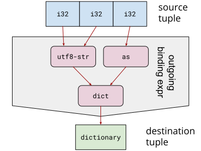
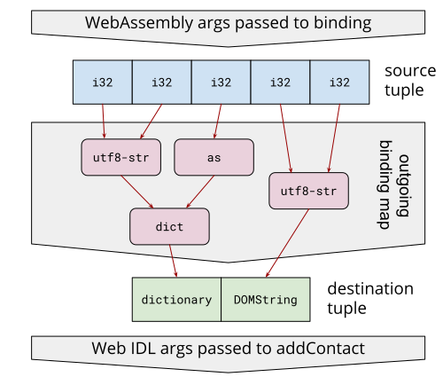
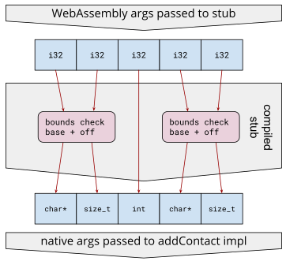
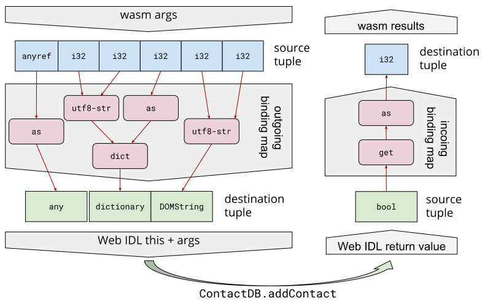
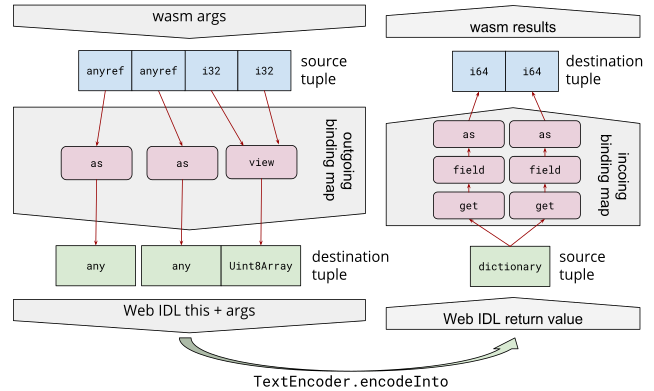

# Web IDL Bindings Proposal

The proposal describes adding a new mechanism to WebAssembly for reliably
avoiding unnecessary overhead when calling, or being called, through a 
[Web IDL] interface.  Not all host environments have Web IDL nor are all host APIs
describable by Web IDL, so this feature is not proposed as part of the core
WebAssembly specification, but rather a new [Embedder Specification], layered
below the [JS Embedding]. This proposal would allow compilers to optimize calls
from WebAssembly into existing Web APIs in browser environments today as well
as other APIs and/or other host environments that may adopt Web IDL in the
future.


## Motivation

With the [Reference Types] proposal, WebAssembly code can pass around arbitrary
JavaScript values using the [`anyref`] value type (by default, JavaScript
values flowing into WebAssembly get boxed into [`ref.host`] values which then get
unboxed whenever flowing back out to JavaScript).  These `ref.host` values are
opaque to WebAssembly, but, by importing JavaScript builtin functions like
[`Reflect.construct`], [`Reflect.apply`], [`Reflect.set`] and [`Reflect.get`],
WebAssembly modules are able to perform many fundamental JavaScript operations
without requiring JavaScript glue code.  In fact, using `Reflect.apply` to
specify the `this`-value of a function call, WebAssembly can call any method
defined in Web IDL by synthesizing appropriate JavaScript values and relying on
the [Web IDL ECMAScript Binding].

However, just removing JS glue code between WebAssembly and Web IDL doesn't
remove all the unnecessary call overhead.  For one thing, all the auxiliary
calls to `Reflect` builtins may end up running slower than the highly
JIT-optimized JS glue code (where these `Reflect` builtins are effectively
inlined).  For another thing, glue code or not, synthesizing JavaScript values
often requires copying WebAssembly values and linear memory into GC-allocated
JS strings and objects that immediately become garbage after the call.  Lastly,
calling a statically-typed Web IDL-defined method through a dynamically-typed
ECMAScript Binding layer can add runtime overhead.


## Overview

To remove the above-mentioned sources of overhead, the proposal allows making
calls between WebAssembly and Web IDL that do not (semantically or in the
implementation) go through the [Web IDL ECMAScript Binding] layer.  This is
enabled by allowing a WebAssembly module to include a list of bindings for
imports and exports that specify how to create a Web IDL function from a
WebAssembly function and vice versa.

An import binding describes how to create a WebAssembly [host function instance][`hostfunc`]
instance from a Web IDL function by specifying:
* the Web IDL function signature, including parameter and result types and
  whether the Web IDL function is a static (the current default), method (with
  an additional `this` parameter) or constructor (with an additional `newTarget`
  parameter).
* for each Web IDL parameter, how to construct the Web IDL argument value out of
  one or more WebAssembly values and possibly the contents of linear memory.
* for the Web IDL return value, how to destructure it into one or more
  WebAssembly values and/or the contents of linear memory.

Conversely, an export binding describes how to create a Web IDL [Callback] value
from a WebAssembly function by specifying the same kinds of things as an import
binding, but "in reverse".

One important property of the proposal is that there can be many bindings for a
given Web IDL signature.  This is important for several reasons:
* As new WebAssembly value types are added (e.g., with [Function References] and
	[GC]), they can be bound in new ways to Web IDL signatures which would not be
  possible if, e.g., a string always had to be passed via an `i32` offset
  into linear memory.
* Even with the WebAssembly MVP's set of types, there can be multiple ways to
  produce a given Web IDL value (e.g., null-terminated vs. explicit length 
  vs. `anyref` for a string).

The set of features described in this proposal is likely too large for an
initial release and therefore will likely be broken down into an initial "MVP"
feature set. Moreover, additional bindings for non-functions are out of scope
of this proposal but could be proposed in the future. For example:
* Bindings could be added mapping Web IDL [Exceptions] to the [Exception Tags]
  of the WebAssembly [Exception Handling] proposal, enabling WebAssembly to
  throw and catch Web IDL exceptions.
* Bindings could be added for [Type Exports] to allow WebAssembly modules to
  create [ES Classes] enabling, e.g., Web Components to be fully implemented in
  WebAssembly.

Given this overview, the proposal is now presented in a bottom-up fashion.


## Web IDL Types

Symmetric to the core WebAssembly [Type Section], all compound Web IDL types are
defined in a **Web IDL Type Subsection** that is stored inside of, and can be
referenced throughout the rest of, the new **Web IDL Bindings Section** being
defined by this proposal. The section/subsection design of Web IDL Bindings
would mirror that of the [Name Section] and allow for extension in the future.

A tentative list of Web IDL compound types includes:
* Function: a signature including one of {static, method or constructor},
  parameter types and return type (used for Web IDL [Operation] and [Callback]
  types)
* [Dictionary]: listing field names and field types
* [Enumeration]: listing string values
* [Union]: listing the member types

Many compound Web IDL types are missing from the above list because these are
the only compound types with explicit operators (introduced below) for
constructing and destructuring values.  New compound types can be added in the
future in conjunction with new operators.  Until then, types not listed above
can be passed using either the Web IDL [`any`] type, which implies a runtime type
check, or, in the future, with a [Type Import][Type Imports] that is checked for
signature-compatibility at instantiation-time, eliminating any runtime checks.
(It is an [open question](#open-questions) whether this proposal should depend
on Type Imports and remove the implicit `any` downcast; the rest of the
proposal assumes "no".)

Compound type definitions also do not include the [Web IDL name]. The
reason for this is that the module-declared Web IDL types are matched against
the actual imported Web IDL functions *structurally*.  For simplicity,
recursive types are disallowed, allowing simple instantiation-time
type-compatibility checks.

Also notably absent is any sort of [Interface] definition listing the members
of an interface.  Due to the lack of polymorphic/virtual dispatch in Web IDL,
these are unnecessary: WebAssembly modules import Web IDL methods directly as
concrete functions and call these functions by passing the `this`-object as an
explicit parameter (as shown in the examples below).

A **Web IDL Type** is either a compound type (in the Web IDL Types Subsection)
or a Web IDL scalar types like `any` or `long`.  This is symmetric to the
proposed WebAssembly [`ref`] type. In the future, [Type Imports] could also be
used as Web IDL Types.

As an example, the Web IDL Dictionary:

```WebIDL
dictionary Contact {
  DOMString name;
  long age;
};
```

could be defined in a WebAssembly module with this (strawman text-format)
statement:

```wasm
(webidl-type $Contact (dict (field "name" DOMString) (field "age" long)))
```

Following the general WebAssembly text format convention, `$Contact` may be
used throughout the Web IDL Bindings Section, with uses converted to the
integer index of the type definition in the Web IDL Types Subsection when the
`.wat` is converted to `.wasm`.


## Binding Operators and Expressions

Web IDL values are manipulated via Web IDL **binding expressions** which, like
core WebAssembly instructions, are defined in the form of [abstract syntax] with
both text and binary formats that are composed of **binding operators** which
can have immediate operands and child expressions.  Binding operators come in
two flavors—**outgoing** and **incoming**—which correspond to the two
directions that values flow through a binding (from a WebAssembly perspective):
outgoing (to Web IDL) or incoming (from Web IDL).  The "outgoing" and
"incoming" distinction is orthogonal to the "import" and "export" distinction:
both import and export bindings use both outgoing and incoming binding
expressions.

An **outgoing binding expression** is composed of **outgoing binding
operators** and maps from a **source tuple** of WebAssembly values to a
**destination tuple** of Web IDL values (although currently only one is ever
produced). A sample list of outgoing binding operators:

| Operator | Immediates | Children | Description |
| :---     | :---       | :---     | :---        |
| **as** | webidl‑type<br>idx | | Takes the `idx`'th wasm value of the source tuple and produces a Web IDL value of `webidl-type`, allowing only trivial conversions (like `i32` to [`long`] or `anyref` to [`any`]). |
| **utf8‑str** | webidl‑type<br>off‑idx<br>len‑idx | | Takes the `off-idx`'th and `len-idx`'th wasm values of the source tuple, which must both be `i32`s, as the offset and length, resp., of a UTF-8 string in linear memory and decodes a `webidl-type`, which must be one of [`DOMString`] or [`USVString`], as specified by [`TextDecoder`]. |
| **utf8‑cstr** | webidl‑type<br>off‑idx	| | Like `utf8-str`, but instead of length being explicitly supplied as a wasm value in the source tuple, the length is found by decoding up to the first null code point. |
| **i32‑to‑enum** | webidl‑type<br>val‑idx	| | Takes the `val-idx`'th wasm value of the source tuple, which must be an `i32`, as an index into the list of strings specified by `webidl-type`, which must be an [Enumeration]. |
| **view** | webidl‑type<br>off‑idx<br>len‑idx | | Takes the `off-idx`'th and `len-idx`'th wasm values of the source tuple, which must both be `i32`s, as the offset and length, resp., of a new `webidl-type`, which must be a [Typed Array View], making a *view* of the bytes. |
| **buffer** | webidl‑type<br>off‑idx<br>len‑idx | | Takes the `off-idx`'th and `len-idx`'th wasm values of the source tuple, which must both be `i32`s, as the offset and length, resp., of a new `webidl-type`, which must be a [`BufferSource`] or [`ByteString`], making a *copy* of the bytes. |
| **dict** | webidl‑type | *out‑exprs* | Create a Web IDL `webidl-type` [Dictionary] value using `out-exprs` as the field values (which must line up with `webidl-type` exactly). |
| **bind‑export** | webidl‑type<br>binding<br>func‑idx | | Takes the `func-idx`'th wasm value of the source tuple, which must be a typed function [`ref`], and applies `binding` to produce a [Callback] value. (See [`BindExport`](#instantiation-and-runtime) below.) |

An **incoming binding expression** is composed of **incoming binding
operators** and maps from a source tuple of Web IDL values to a **destination
tuple** of WebAssembly values.  A sample list of incoming binding operators:

| Operator | Immediates | Children | Description |
| :---     | :---       | :---     | :---        |
| **get** | idx	| |	Return the `idx`th Web IDL value of the source tuple. |
| **as** | wasm‑type | *in‑expr* | Take the result of `in-expr`, which can be any Web IDL value, and produces a wasm value of `wasm-type`, allowing only trivial conversions (like [`long`] to `i32` or [`any`] to `anyref`). |
| **alloc‑utf8‑str** | alloc‑func‑idx | *in‑expr* | Take the result of `in-expr`, which must be either [`DOMString`] or [`USVString`], compute the number of bytes necessary to store a UTF-8 encoding of this string, call the `alloc-func-idx`'th function of the receiving instance, passing the number of bytes and using the resulting offset to store the UTF-8 encoding, as specified by [`TextEncoder`], finally returning the offset and byte-length as two `i32`s (and trapping on OOM). |
| **alloc‑buffer** | alloc‑func‑idx | *in‑expr* | Take the result of `in-expr`, which must be a [`BufferSource`] or [`ByteString`], call the `alloc-func-idx`'th function of the receiving instance, passing the length and using the resulting offset to store a copy of the bytes into linear memory, returning the offset and byte-length as two `i32`s (and trapping on OOM). |
| **enum‑to‑i32** | webidl‑type | *in‑expr* | Take the result of `in-expr`, which must be an [Enumeration] value, and reverse-map this string to the `i32` index of the matching string in the `webidl-type`, which must also be an Enumeration. |
| **field** | field‑idx | *in‑expr*	| Take the result of `in-expr`, which must be a [Dictionary] value, and return the Web IDL value of the `field-idx`'th field. |
| **bind‑import** | wasm‑type<br>binding | *in‑expr* | Take the result of `in-expr`, which must be a [Callback] value, and apply `binding` to produce a [`funcref`]  (or, later, a typed function reference). (See [`BindImport`](#instantiation-and-runtime) below.) |

For example, building on the previous section's example, a Web IDL value of the
`$Contact` dictionary type could be produced from three WebAssembly `i32`s by
the following (strawman text-format) binding expression:

```wasm
(dict $Contact (utf8-str DOMString off-idx=0 len-idx=1) (as type=long idx=2))
```

This binding expression can be visualized:




## Binding Maps

A Web IDL **binding map** allows mapping between *entire tuples* of WebAssembly
and Web IDL values via a *tuple* of binding expressions.  All binding
expressions consume the same source tuple.  In contrast, the destination tuple
of the binding map is created by concatenating the destination tuples of each
individual binding expression.

Binding maps are either incoming or outgoing.  **Incoming binding maps** contain
only incoming binding expressions and are applied to the parameters of exported
functions and the results of imported functions.  Conversely, **outgoing binding
maps** contain only outgoing binding expressions and are applied to the results of
exported functions or the parameters of imported functions.

For example, building on the previous example, to create the *parameter* tuple to pass to this Web IDL method:

```WebIDL
interface ContactDB {
  bool addContact(Contact contact, DOMString contactBook);
};
```

the following (strawman text-format, which is just a sequence of binding
expressions) binding map could be used:

```wasm
(dict $Contact (utf8-str DOMString off-idx=0 len-idx=1) (as type=long idx=2))
(utf8-str DOMString off-idx=3 len-idx=4)
```

This binding map can be visualized:



When the binding map is compiled to machine code by an engine implementing Web
IDL Bindings, the stub can map the `i32` WebAssembly values to the positional,
bounds-checked pointer+length arguments that are ideal for the underlying native
host implementation of `addContact`:




## Function Bindings

To bind an *entire function*, there are five ingredients:
* a bit indicating "import" or "export"
* a WebAssembly [`functype`]  (defined by the WebAssembly [Type Section])
* a Web IDL Function type (defined in the Web IDL [Type Subsection](#web-idl-types))
* an (outgoing for import, incoming for export) binding map for the parameters
* an (incoming for import, outgoing for export) binding map for the results

For example, building on the previous example, the following (strawman
text-format) statement would define a Web IDL Function type compatible with
`addContact`:

```wasm
(webidl-type $AddContactFuncWebIDL
  (func (method any) (param (dict $Contact) DOMString) (result bool)))
```

Here, the `method` field specifies that the function is a "[regular operation]"
which expects a `this`-value and that the `this`-value is passed with an `any`
type.

The following (official text format) statement defines the WebAssembly function
type which the WebAssembly module would use to call `addContact`:

```wasm
(type $AddContactFuncWasm (func (param anyref i32 i32 i32 i32 i32) (result i32)))
```

With all these, a Web IDL function binding named `$addContactBinding` can be defined:

```wasm
(webidl-func-binding $addContactBinding import $AddContactFuncWasm $AddContactFuncWebIDL
  (param
    (as type=any idx=0)
    (dict $Contact (utf8-str type=DOMString off-idx=1 len-idx=2) (as type=long idx=3))
    (utf8-str type=DOMString off-idx=4 len-idx=5))
  (result
    (as type=i32 (get idx=0))))
```

Since `$AddContactFuncWebIDL` declared the function to be a method, the first
element of the parameter binding map's destination tuple will be used as the
`this`-value.

Lastly, we need the WebAssembly function import statement (that is called by the rest of the WebAssembly module) and a Web IDL statement to link the import to the binding:

```wasm
(func $addContact (import "ContactDB" "addContact") (type $AddContactFuncWasm))
(webidl-bind $addContact $addContactBinding)
```

The `webidl-bind` statement is necessary because a single binding can be used
multiple times, for both exports and the `bind` operators described above.

The whole bound call path can be visualized:




## Validation

The Web IDL Bindings section is defined as a [custom section], which means that it
is ignored by core WebAssembly validation rules.  However, the Web IDL Bindings
spec specifies validation rules for this custom section which are checked
alongside core module validation and produce fatal errors by any host that
supports Web IDL Bindings.

This design enables a polyfill to feature-test the presence of Web IDL Bindings
by calling [`WebAssembly.validate`] with a (tiny, inline) module with an invalid
Web IDL Bindings section so that `WebAssembly.validate` will return `false` if
and only if Web IDL Bindings is supported.  If Web IDL Bindings are not
supported, Web IDL Bindings can be emulated using JavaScript functions that wrap
imports and exports.

Validating a Web IDL Bindings section primarily involves type checking all the
contained binding expressions relative to the respective source and destination
tuple types of the WebAssembly or Web IDL function signatures of the function
binding.  Although the precise static semantics are outside the scope of this
document, they should be able to follow the same general [validation conventions]
as core WebAssembly.


## Instantiation and Runtime

There are two runtime spec operations exposed by the Web IDL Bindings proposal
that get invoked by client specs (e.g., the [JS Embedding]):
* `BindExport(export-binding, wasm-funcref) : Callback`
* `BindImport(import-binding, webidl-function) : funcaddr`

`BindExport` creates a Web IDL [Callback] value which can either be used at
instantiation-time, to create the export values of the WebAssembly instance, or
at runtime, via the `bind` binding operator described [above](#binding-operators-and-expressions).
In either case, the `Callback` value, when called by the host, will use the
given `export-binding` to map Web IDL calls to WebAssembly calls of the given
`wasm-funcref`.

`BindImport` creates a [`funcaddr`] value which can either be used at
instantiation-time, to create an [`externval`] passed to [`instantiate_module`],
or at runtime, via the `bind` binding operator described [above](#binding-operators-and-expressions),
to create a first-class [`ref.host`] parameter or return value.  The bound
`funcaddr` will be the address of a [`hostfunc`] which, when called, will use
the given `import-binding` to map WebAssembly calls to Web IDL calls of the
given `webidl-function`.

Both `BindExport` and `BindImport` assume that the host has already ensured that
the given function is compatible with the given binding.  As explained and shown
in the examples above, "compatibility" doesn't mean classic subtyping; in
particular, `any` is allowed to be passed for a variety of Web IDL types that
are able to be converted with a dynamically-checked downcast. (If this case was
removed by relying on Type Imports, then the check *could* be classic subtyping;
this is an [open question](#open-questions).)


## JS API Integration

The final step, to tie everything together, is for host embedding to invoke the
above-mentioned spec-routines defined by Web IDL Binding.  There are four
primary points where this happens:
1. When the module is [decoded][`decode_module`], the Web IDL Binding Section must
   be decoded as well.
2. When the module is [validated][`validate_module`], the Web IDL Binding Section
   (decoded by step 1) must be as well.
3. When the module is [instantiated][`instantiate_module`], each `webidl-bind`
   statement binding an import must invoke `BindImport` to produce list of
   `externval` passed to `instantiate_module`.
4. When the module's [exports are extracted][`module_exports`], each `webidl-bind`
   statement binding an export must invoke `BindExport` to replace the
   WebAssembly export with a bound Web IDL Callback value.

For the specific case of the [JS Embedding], there are two interesting remaining
questions:

**Question #1**: When Web IDL Bindings are used, where do the import values come from?

With just Web IDL Bindings, the answer to this question doesn't change from the
status quo today which is: JavaScript glue code has to explicitly assemble the
`importObject` which is passed to [`WebAssembly.instantiate`] et al.  Thus, to
import a Web IDL function, JavaScript glue code would need to grab the
[Web IDL-created function objects][Create Operation Function] off the prototypes
of the constructors stored on the JavaScript global object.  Additionally,
getter and setter functions would need to be extracted via
[`Object.getOwnPropertyDescriptor`].  It's important to note that, while it is a
JavaScript function being passed into the JS API, this function would be
semantically "unwrapped" by the JS API to get the underlying Web IDL function
which is actually imported and called.

In the future, though, a combination of additional features could allow a
WebAssembly module to import Web APIs more directly:
* [ESM-integration], allowing WebAssembly instantiated by the
  [HTML module loader].
* [Built-in modules][JS Standard Library], allowing all ESMs (JS and
  WebAssembly) to import modules provided by the host (with polyfilling and
  censoring provided by [import-maps]).
* [Automatic reflection of *all* Web APIs as built-in modules][Everything Is A Module],
  with the import module/field names derived from the API's Web IDL signature.

**Question #2**: What happens when there is a Web IDL import binding but the
imported value either has an incompatible Web IDL signature or doesn't have a
Web IDL signature at all (e.g., a JS function)?

One option would be to throw an instantiation error, but this would break a
number of polyfilling and patching use cases.  Instead, given the expected Web
IDL Function type (specified by the import binding), the imported JavaScript
function can be coerced to be a Web IDL function using the Web IDL spec's
existing [JavaScript-to-Callback conversion].

When the WebAssembly-to-Web IDL conversion specified by WebAssembly-Web IDL
Bindings is composed with the Web IDL-to-JavaScript conversion specified by the
Web IDL-ECMAScript Binding, the resulting conversion is useful in general,
addressing several ([long-standing](https://github.com/WebAssembly/design/issues/657))
JS API use cases:
* being able to specify a `this`-value for calls to JS imports
* being able to override the default signed interpretation of `i32` and `i64`
* consuming/producing strings (a DOMString *is* a JS string)
* consuming/producing JSON(-esque) blobs (via Dictionary and Sequence)

This fallback-to-JS behavior for incompatible Web IDL signatures also avoids
three practical compatibility hazards:
* If a JavaScript Built-in function that today has no Web IDL signature is
  imbued with a Web IDL signature by a future iteration of the spec, this new
  Web IDL signature may be subtly incompatible with extant uses of the
  Built-in; the fallback behavior ensures adding a Web IDL signature to a
  Built-in is always backwards-compatible.
* If two browsers have slightly Web IDL signatures (which can occur for
  historical compatibility reasons); the fallback behavior helps avoid
  unnecssary hard failures.
* Sometimes Web IDL specifications are refactored over time (e.g., changing a
  `long` to a `double`), assuming the coercive semantics of JavaScript;
  the fallback behavior similarly avoids hard failures.

(To help well-intentioned developers avoid unintended performance degredation,
WebAssembly engines should emit warning diagnostics on Web IDL signature
mismatch.)


## Example: TextEncoder.encodeInto

An abridged Web IDL signature for [`encodeInto`] is:

```WebIDL
dictionary TextEncoderEncodeIntoResult {
  unsigned long long read;
  unsigned long long written;
};

[Constructor]
interface TextEncoder {
  TextEncoderEncodeIntoResult encodeInto(USVString source, Uint8Array destination);
};
```

The signature of `encodeInto` could be defined with these (strawman text-format)
statements:

```wasm
(webidl-type $TEEIR
   (dict (field "read" unsigned long long) (field "written" unsigned long long)))
(webidl-type $EncodeIntoFuncWebIDL
   (func (method any) (param USVString Uint8Array) (result (dict $TEEIR))))
```

The WebAssembly signature and import which would be used to call `encodeInto`
would be:

```wasm
(type $EncodeIntoFuncWasm (param anyref anyref i32 i32) (result i64 i64))
(func $encodeInto (import "TextEncoder" "encodeInto") (type $EncodeIntoFuncWasm))
```

Finally, the binding is accomplished with these two (strawman text-format)
statements:

```wasm
(webidl-func-binding $encodeIntoBinding import $EncodeIntoFuncWasm $EncodeIntoFuncWebIDL
    (param (as type=any idx=0) (as type=any idx=1) (view type=uint8 off-idx=2 len-idx=3))
    (result (as type=i64 (field "read" (get 0))) (as type=i64 (field "written" (get 0)))))
(webidl-bind $encodeInto $encodeIntoBinding)
```

This function binding can be visualized:



To get the `anyref` `this`-value, a WebAssembly module must *additionally*
import the `TextEncoder` constructor, with the strawman
`(constructor default-new-target)` syntax indicating the default `newTarget`
(the callee constructor).

```wasm
(webidl-type $CtorFuncWebIDL (func (constructor default-new-target) (result any)))

(type $CtorFuncWasm (func (result anyref)))
(func $TextEncoderCtor (import "TextEncoder" "ctor") (type $CtorFuncWasm))

(webidl-func-binding $CtorBinding import $CtorFuncWasm $CtorFuncWebIDL
  (result (as type=anyref (get 0))))
(webidl-bind $TextEncoderCtor $CtorBinding)
```

With these bindings, a WebAssembly module can call `$TextEncoderCtor`, store
the result in an `anyref` global and then pass that global value as the first
argument to all subsequent calls to `$encodeInto`.

Lastly, to instantiate this module (without any of the additional ESM features
that were discussed [above](#JS-API-integration)), the embedding JavaScript would
populate the import object with functions plucked from the global object stored
in properties that match the import module/field names above.

```js
WebAssembly.instantiateStreaming(fetch('encodeInto-example.wasm'), {
  TextEncoder: {
    encodeInto: TextEncoder.prototype.encodeInto,
    ctor: TextEncoder
  }
}).then(...);
```

## FAQ

### Does this proposal add any new low-level capabilities, APIs or backdoors?

No; it just optimizes calls to *existing* APIs that, in the case of the Web,
are already exposed to JavaScript.

### Will Web IDL Binding Expressions grow to duplicate WebAssembly?

No; the criteria for adding a [binding operator](#binding-operators-and-expressions)
is that the operator must express something that couldn't be expressed
(without significant overhead) in WebAssembly.  That's why, e.g., there are no
numeric conversion binding operators.

### What about bindings for non-Web IDL APIs?

For the case of pre-existing APIs (e.g., Java class libraries or C APIs or RPC
IDLs), the APIs' interfaces will likely have very different idioms and types
used in signatures, thereby requiring a binding section with very different
types and binding operators from the ones presented above.  Attempting to force
one IDL (with hard backwards-compatibility requirements) to satisfy all these
disparate use cases would likely lead to a suboptimal outcome for all APIs.

In contrast, having a separate binding section specification for each separate
idiomatic family of APIs would allow each to be ideally suited and even allow a
single WebAssembly module, with a single WebAssembly function import to have
multiple bindings, allowing it to run efficiently in multiple environments (due
to the ignored-if-unknown default behavior of [custom sections][custom section]).

For the case of new, designed-for-WebAssembly APIs, the API can use core
WebAssembly value types, avoiding the need for bindings at all, or use Web IDL
Bindings, gaining a certain amount of Web interoperability "for free".  Based on
practical experience with Web IDL Bindings, new bindings could be designed in
the future to optimally handle the use cases that remain, outside the
constraints of Web APIs' backwards-compatibility.

## Open Questions

* What goes into the "MVP" release of this proposal?
* Should Web IDL Bindings block on [Type Imports]  (factored out of the GC
  proposal) to remove the implicit `any`-to-Web IDL conversions mentioned
  above?


[Embedder Specification]: https://webassembly.github.io/spec
[JS Embedding]: https://webassembly.github.io/spec/js-api/index.html

[core spec]: https://webassembly.github.io/spec/core
[abstract syntax]: https://webassembly.github.io/spec/core/syntax/conventions.html
[Validation Conventions]: https://webassembly.github.io/spec/core/valid/conventions.html
[Type Section]: https://webassembly.github.io/spec/core/binary/modules.html#binary-typesec
[Custom Section]: https://webassembly.github.io/spec/core/binary/modules.html#custom-section
[Name Section]: https://webassembly.github.io/spec/core/appendix/custom.html#name-section
[Function Instance]: https://webassembly.github.io/spec/core/exec/runtime.html#function-instances
[`decode_module`]: https://webassembly.github.io/spec/core/appendix/embedding.html#embed-decode-module
[`validate_module`]: https://webassembly.github.io/spec/core/appendix/embedding.html#embed-validate-module
[`instantiate_module`]: https://webassembly.github.io/spec/core/appendix/embedding.html#embed-instantiate-module
[`module_exports`]: https://webassembly.github.io/spec/core/appendix/embedding.html#embed-exports
[`functype`]: https://webassembly.github.io/spec/core/syntax/types.html#function-types
[`funcaddr`]: https://webassembly.github.io/spec/core/exec/runtime.html#syntax-funcaddr
[`hostfunc`]: https://webassembly.github.io/spec/core/exec/runtime.html#syntax-hostfunc
[`externval`]: https://webassembly.github.io/spec/core/exec/runtime.html#syntax-externval

[Web IDL]: https://heycam.github.io/webidl
[Web IDL ECMAScript Binding]: https://heycam.github.io/webidl/#ecmascript-binding
[Web IDL name]: https://heycam.github.io/webidl/#idl-names
[Create Operation Function]: https://heycam.github.io/webidl/#dfn-create-operation-function
[JavaScript-to-Callback conversion]: https://heycam.github.io/webidl/#es-callback-function
[Exceptions]: https://heycam.github.io/webidl/#idl-exceptions
[Callback]: https://heycam.github.io/webidl/#idl-callback-function
[Operation]: https://heycam.github.io/webidl/#idl-operations
[Regular Operation]: https://heycam.github.io/webidl/#dfn-regular-operation
[Dictionary]: https://heycam.github.io/webidl/#idl-dictionaries
[Enumeration]: https://heycam.github.io/webidl/#idl-enumeration
[Interface]: https://heycam.github.io/webidl/#idl-interfaces
[Union]: https://heycam.github.io/webidl/#idl-union
[Typed Array View]: https://heycam.github.io/webidl/#dfn-typed-array-type
[`BufferSource`]: https://heycam.github.io/webidl/#BufferSource
[`any`]: https://heycam.github.io/webidl/#idl-any
[`long`]: https://heycam.github.io/webidl/#idl-long
[`DOMString`]: https://heycam.github.io/webidl/#idl-DOMString
[`ByteString`]: https://heycam.github.io/webidl/#idl-ByteString
[`USVString`]: https://heycam.github.io/webidl/#idl-USVString

[Reference Types]: https://github.com/WebAssembly/reference-types/blob/master/proposals/reference-types/Overview.md
[`anyref`]: https://webassembly.github.io/reference-types/core/syntax/types.html#syntax-reftype
[`funcref`]: https://webassembly.github.io/reference-types/core/syntax/types.html#syntax-reftype
[`ref.host`]: https://webassembly.github.io/reference-types/core/exec/runtime.html#syntax-ref-host

[Function References]: https://github.com/WebAssembly/function-references/blob/master/proposals/function-references/Overview.md
[`ref`]: https://github.com/WebAssembly/function-references/blob/master/proposals/function-references/Overview.md#value-types

[GC]: https://github.com/WebAssembly/gc/blob/master/proposals/gc/Overview.md
[Type Exports]: https://github.com/WebAssembly/gc/blob/master/proposals/gc/MVP.md#exports
[Type Imports]: https://github.com/WebAssembly/gc/blob/master/proposals/gc/MVP.md#imports

[Exception Handling]: https://github.com/WebAssembly/exception-handling/blob/master/proposals/Exceptions.md
[Exception Tags]: https://github.com/WebAssembly/exception-handling/blob/master/proposals/Exceptions.md#exceptions

[ESM-integration]: https://github.com/WebAssembly/esm-integration

[HTML module loader]: https://html.spec.whatwg.org/multipage/webappapis.html#integration-with-the-javascript-module-system
[`TextEncoder`]: https://encoding.spec.whatwg.org/#interface-textencoder
[`TextDecoder`]: https://encoding.spec.whatwg.org/#interface-textdecoder
[`encodeInto`]: https://encoding.spec.whatwg.org/#ref-for-dom-textencoder-encodeinto

[JS Standard Library]: https://github.com/tc39/proposal-javascript-standard-library
[import-maps]: https://github.com/WICG/import-maps
[Everything Is A Module]: https://github.com/heycam/webidl/issues/676

[ES Classes]: https://developer.mozilla.org/en-US/docs/Web/JavaScript/Reference/Classes
[`Object.getOwnPropertyDescriptor`]: https://developer.mozilla.org/en-US/docs/Web/JavaScript/Reference/Global_Objects/Object/getOwnPropertyDescriptor
[`Reflect.construct`]: https://developer.mozilla.org/en-US/docs/Web/JavaScript/Reference/Global_Objects/Reflect/construct
[`Reflect.apply`]: https://developer.mozilla.org/en-US/docs/Web/JavaScript/Reference/Global_Objects/Reflect/apply
[`Reflect.set`]: https://developer.mozilla.org/en-US/docs/Web/JavaScript/Reference/Global_Objects/Reflect/set
[`Reflect.get`]: https://developer.mozilla.org/en-US/docs/Web/JavaScript/Reference/Global_Objects/Reflect/get
[`WebAssembly.validate`]: https://developer.mozilla.org/en-US/docs/Web/JavaScript/Reference/Global_Objects/WebAssembly/validate
[`WebAssembly.instantiate`]: https://developer.mozilla.org/en-US/docs/Web/JavaScript/Reference/Global_Objects/WebAssembly/instantiate
